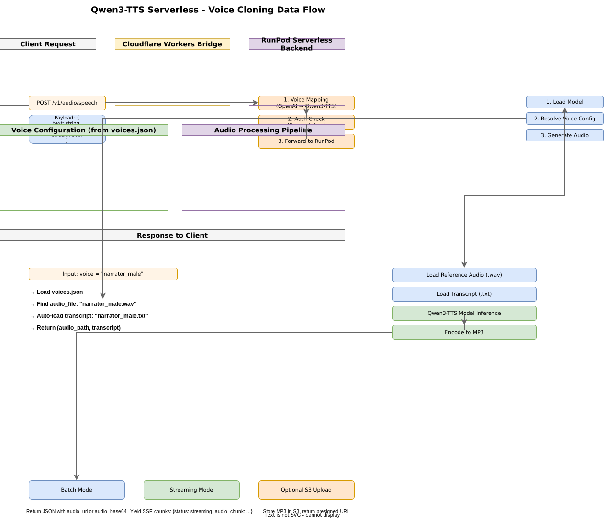
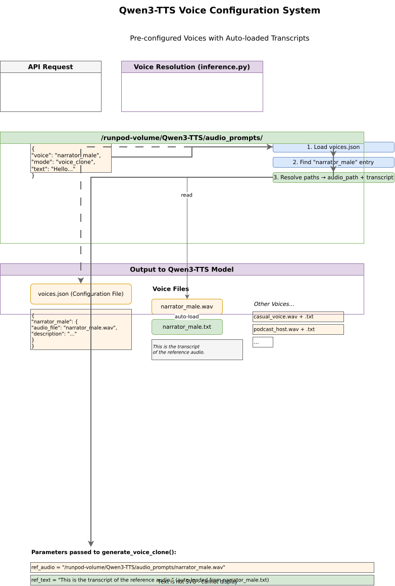

# Qwen3-TTS Serverless — Nigerian Accent + Emotion Fork

RunPod Serverless deployment for Qwen3-TTS (Alibaba's state-of-the-art text-to-speech system) with Cloudflare Workers bridge for OpenAI TTS API compatibility.

**Fork customizations (vs. upstream `sruckh/Qwen3-TTS-serverless`):**
- **Default model is now `VoiceDesign`** (was `Base`) — the only model that supports free-form accent + emotion control in a single `instruct` string.
- **Nigerian English accent support**: `instruct="Nigerian male, deep warm voice, speak cheerfully"` produces a Nigerian-accented voice with the requested emotion in one call.
- **`voice_instruct` alias**: added as a DashScope-API-compatible alias for `instruct` in both `handler.py` and `inference.py`. When both `instruct` and `voice_instruct` are supplied, they are concatenated.
- **GPU optimizations**: Flash Attention 2 (auto-detected at load), BFloat16 default dtype, TF32 matmul, cuDNN benchmark mode, and optional `torch.compile` via `TORCH_COMPILE=1`.
- **Network-volume model auto-detection**: `config.py` checks `/workspace/Qwen3-TTS/models/` for pre-downloaded weights before falling back to HuggingFace download; `MODEL_PATH` env var overrides the selected model type.

## Features

- **Voice Cloning**: 3-second rapid voice cloning from reference audio with transcript
- **Custom Voice**: 9 pre-defined premium speakers with instruction control
- **Voice Design**: Natural language voice description for custom voice creation — **including accent (e.g. Nigerian) and emotion in one prompt**
- **Nigerian Accent + Emotion**: combine accent and mood in a single `instruct` string (VoiceDesign mode)
- **Multi-language Support**: Chinese, English, Japanese, Korean, German, French, Russian, Portuguese, Spanish, Italian
- **Streaming & Batch Modes**: Low-latency streaming or complete audio generation
- **OpenAI TTS API Compatible**: Drop-in replacement via Cloudflare Workers bridge
- **Pre-configured Voices**: Store reference audio with auto-loaded transcripts

## Architecture

The system consists of four main layers:

1. **Client Layer**: Web UI, mobile apps, API clients (using OpenAI SDK), CLI tools
2. **Cloudflare Workers Bridge**: OpenAI TTS API compatible endpoints with voice mapping
3. **RunPod GPU Serverless**: Backend running Qwen3-TTS inference
4. **Network Volume**: Persistent storage for models, cache, and voice configurations

### Data Flow



Request flow from client → Cloudflare bridge → RunPod backend with voice resolution, model loading, audio generation, and MP3 encoding.

### Voice Configuration System



The voice configuration system uses a simple file-pairing mechanism:
- Each voice has an audio file (`.wav`) and a transcript file (`.txt`) with the same base name
- `voices.json` maps voice names to audio files
- Transcripts are automatically loaded when a voice is requested

## Components

### 1. RunPod Serverless Backend

Located in root directory:
- **`handler.py`**: Main RunPod serverless handler (batch + streaming)
- **`inference.py`**: Qwen3-TTS inference engine with model loading
- **`config.py`**: Configuration for paths, defaults, validation
- **`bootstrap.sh`**: Runtime setup script (installs dependencies on first run)
- **`Dockerfile`**: Container image for RunPod
- **`requirements.txt`**: Python dependencies

### 2. Cloudflare Workers Bridge

Located in `bridge/` directory:
- **`worker.js`**: OpenAI TTS API compatible endpoints
- **`wrangler.toml`**: Cloudflare Workers configuration
- **`voices.json`**: Voice mappings for OpenAI voice names to Qwen3-TTS speakers
- **`README.md`**: Bridge-specific documentation

### 3. Voice Configuration

Located in `audio_prompts/` directory (on network volume):
- **`voices.json`**: Maps voice names to audio files and metadata
- **`*.wav`**: Reference audio files for voice cloning
- **`*.txt`**: Transcript files (same base name as audio)

## Model Types

| Model | Use Case | Key Parameters |
|-------|----------|----------------|
| **Base** | Voice cloning (3s rapid) | `voice` (pre-configured) OR `ref_audio` + `ref_text` |
| **CustomVoice** | Pre-defined speakers | `speaker` (Vivian, Ryan, etc.) + optional `instruct` |
| **VoiceDesign** *(default)* | Natural language control — **accent + emotion** | `instruct` (voice description, e.g. `"Nigerian female, warm and cheerful"`) |

> **Default model**: This fork defaults `MODEL_TYPE` to `VoiceDesign` (Dockerfile `ENV` + `config.py` default). Nigerian accent + emotion control is only available in VoiceDesign mode.

## Voice Configuration

### Setting Up Pre-configured Voices

1. Place your reference audio files in `/runpod-volume/Qwen3-TTS/audio_prompts/`
2. Create transcript files with the same base name (`.txt` extension)
3. Update `voices.json` to map voice names to audio files

**Example directory structure:**
```
/runpod-volume/Qwen3-TTS/audio_prompts/
├── voices.json
├── narrator_male.wav
├── narrator_male.txt          # Transcript of the audio
├── narrator_female.wav
├── narrator_female.txt
├── casual_voice.wav
└── casual_voice.txt
```

**Example `voices.json`:**
```json
{
  "narrator_male": {
    "audio_file": "narrator_male.wav",
    "description": "Professional male narrator, clear and articulate",
    "language": "English",
    "gender": "male"
  },
  "casual_voice": {
    "audio_file": "casual_voice.wav",
    "description": "Casual conversational voice",
    "language": "English",
    "gender": "neutral"
  }
}
```

**Note**: The transcript will be auto-loaded from the `.txt` file. You can also provide `transcript` directly in `voices.json` to override the file.

## API Usage

### Via Cloudflare Bridge (Recommended)

#### OpenAI TTS Compatible (Batch Mode)

```bash
curl https://your-worker.workers.dev/v1/audio/speech \
  -H "Authorization: Bearer YOUR_AUTH_TOKEN" \
  -H "Content-Type: application/json" \
  -d '{
    "model": "qwen3-tts",
    "input": "Hello, world!",
    "voice": "alloy",
    "response_format": "mp3"
  }' \
  --output speech.mp3
```

#### Voice Cloning with Pre-configured Voice

```bash
curl https://your-worker.workers.dev/api/tts/stream \
  -H "Authorization: Bearer YOUR_AUTH_TOKEN" \
  -H "Content-Type: application/json" \
  -d '{
    "text": "This is a test with my custom voice.",
    "mode": "voice_clone",
    "voice": "narrator_male",
    "language": "English",
    "stream": false
  }' \
  --output speech.mp3
```

#### Streaming Mode

```bash
curl https://your-worker.workers.dev/v1/audio/speech \
  -H "Authorization: Bearer YOUR_AUTH_TOKEN" \
  -H "Content-Type: application/json" \
  -d '{
    "model": "qwen3-tts",
    "input": "This is a streaming test.",
    "voice": "nova",
    "stream": true
  }'
```

### Direct to RunPod Serverless

#### Voice Cloning (Pre-configured Voice)

```bash
curl -X POST https://api.runpod.ai/v2/YOUR_ENDPOINT_ID/runsync \
  -H "Authorization: Bearer YOUR_RUNPOD_API_KEY" \
  -H "Content-Type: application/json" \
  -d '{
    "text": "Hello from Qwen3-TTS!",
    "mode": "voice_clone",
    "voice": "narrator_male",
    "language": "English",
    "stream": false
  }'
```

#### Custom Voice Mode (Pre-defined Speakers)

```bash
curl -X POST https://api.runpod.ai/v2/YOUR_ENDPOINT_ID/runsync \
  -H "Authorization: Bearer YOUR_RUNPOD_API_KEY" \
  -H "Content-Type: application/json" \
  -d '{
    "text": "Hello, world!",
    "mode": "custom_voice",
    "speaker": "Ryan",
    "language": "English",
    "instruct": "Very happy and energetic.",
    "stream": false
  }'
```

#### Voice Design Mode (Natural Language Control)

```bash
curl -X POST https://api.runpod.ai/v2/YOUR_ENDPOINT_ID/runsync \
  -H "Authorization: Bearer YOUR_RUNPOD_API_KEY" \
  -H "Content-Type: application/json" \
  -d '{
    "text": "Hey there! How are you doing today?",
    "mode": "voice_design",
    "instruct": "Young female, cheerful and upbeat, speaks with excitement",
    "language": "English",
    "stream": false
  }'
```

#### Voice Design — Nigerian Accent + Emotion (this fork's primary use case)

The `instruct` string accepts both **accent** and **emotion** descriptors at once. This is the recommended path for Nigerian-accented TTS:

```bash
curl -X POST https://api.runpod.ai/v2/YOUR_ENDPOINT_ID/runsync \
  -H "Authorization: Bearer YOUR_RUNPOD_API_KEY" \
  -H "Content-Type: application/json" \
  -d '{
    "text": "Wetin dey happen today? I dey happy see you!",
    "mode": "voice_design",
    "instruct": "Nigerian male, deep warm voice, speak cheerfully with a relaxed pidgin tone",
    "language": "English",
    "stream": false
  }'
```

You can also use the `voice_instruct` alias (DashScope API compatibility) — supplying both `instruct` and `voice_instruct` concatenates them:

```bash
curl -X POST https://api.runpod.ai/v2/YOUR_ENDPOINT_ID/runsync \
  -H "Authorization: Bearer YOUR_RUNPOD_API_KEY" \
  -H "Content-Type: application/json" \
  -d '{
    "text": "Good morning, how far?",
    "mode": "voice_design",
    "voice_instruct": "Nigerian female, bright and friendly, slightly laughing",
    "language": "English",
    "stream": false
  }'
```

#### Voice Cloning (Dynamic Audio + Transcript)

```bash
curl -X POST https://api.runpod.ai/v2/YOUR_ENDPOINT_ID/runsync \
  -H "Authorization: Bearer YOUR_RUNPOD_API_KEY" \
  -H "Content-Type: application/json" \
  -d '{
    "text": "This uses a dynamically provided reference.",
    "mode": "voice_clone",
    "ref_audio": "https://example.com/reference.wav",
    "ref_text": "This is the transcript of the reference audio.",
    "language": "English",
    "stream": false
  }'
```

## API Reference

### Request Parameters

| Parameter | Type | Required | Description |
|-----------|------|----------|-------------|
| `text` | string | Yes | Text to synthesize |
| `mode` | string | No | Generation mode: `custom_voice`, `voice_design`, `voice_clone` (default: `custom_voice`) |
| `language` | string | No | Language code (default: `Auto` for auto-detection) |
| `stream` | boolean | No | Enable streaming mode (default: `false`) |
| `output_format` | string | No | Output format: `mp3` or `pcm_16` (default: `mp3`) |

#### CustomVoice Mode Parameters

| Parameter | Type | Required | Description |
|-----------|------|----------|-------------|
| `speaker` | string | No | Speaker name (default: `Ryan`) |
| `instruct` | string | No | Voice instruction for style control |

#### VoiceDesign Mode Parameters

| Parameter | Type | Required | Description |
|-----------|------|----------|-------------|
| `instruct` | string | Yes* | Natural language voice description (accent + emotion) |
| `voice_instruct` | string | No | Alias for `instruct` (DashScope API compatibility). If both are given, they are concatenated. |

*Required if `voice_instruct` not provided.

#### VoiceClone Mode Parameters

| Parameter | Type | Required | Description |
|-----------|------|----------|-------------|
| `voice` | string | No* | Pre-configured voice name from `voices.json` |
| `ref_audio` | string | No** | Reference audio (path, URL, base64) |
| `ref_text` | string | No** | Transcript of reference audio |
| `x_vector_only_mode` | boolean | No | Use only speaker embedding (default: `false`) |

*Required if `ref_audio` not provided
**Required if `voice` not provided

#### Using the `instruct` Parameter

The `instruct` parameter accepts natural language descriptions to control voice characteristics. This works for both CustomVoice and VoiceDesign modes.

**Speed Control** (no numeric speed parameter exists):
- `"Speak slowly and deliberately"` / `"语速放慢"`
- `"Speak at a calm, measured pace"`
- `"Speak quickly"` / `"语速极快"`

**Emotion & Tone**:
- `"Very happy and energetic"`
- `"Speak in a serious, authoritative tone"`
- `"用特别愤怒的语气说"` (speak in an angry tone)

**Combined Example**:
```json
{
  "text": "Important announcement.",
  "mode": "custom_voice",
  "speaker": "Ryan",
  "instruct": "Speak slowly and clearly with a calm, professional tone"
}
```

**Note**: The OpenAI TTS API's `speed` parameter (0.25-4.0) is not supported via the Cloudflare bridge. Use direct RunPod requests with the `instruct` parameter for speech rate control.

### Response Format (Batch Mode)

```json
{
  "status": "success",
  "sample_rate": 24000,
  "duration_sec": 3.45,
  "audio_url": "https://s3.../output.mp3"  // or "audio_base64": "..."
}
```

### Response Format (Streaming Mode)

Server-Sent Events (SSE) with chunks:

```
data: {"chunk": 1, "format": "mp3", "audio": "...", "sample_rate": 24000}

data: {"status": "complete", "total_chunks": 1, "elapsed_time_seconds": 2.3}
```

## Built-in Speakers (CustomVoice)

| Speaker | Voice Description | Native Language |
|---------|------------------|-----------------|
| Vivian | Bright, slightly edgy young female | Chinese |
| Serena | Warm, gentle young female | Chinese |
| Uncle_Fu | Seasoned male, low/mellow timbre | Chinese |
| Dylan | Youthful Beijing male, clear/natural | Chinese (Beijing) |
| Eric | Lively Chengdu male, husky/bright | Chinese (Sichuan) |
| Ryan | Dynamic male, strong rhythmic drive | English |
| Aiden | Sunny American male, clear midrange | English |
| Ono_Anna | Playful Japanese female, light/nimble | Japanese |
| Sohee | Warm Korean female, rich emotion | Korean |

## OpenAI Voice Mapping

| OpenAI Voice | Qwen3-TTS Speaker | Description |
|--------------|-------------------|-------------|
| `alloy` | Ryan | Dynamic male (English) |
| `echo` | Aiden | Sunny American male |
| `fable` | Vivian | Bright young female |
| `onyx` | Uncle_Fu | Deep seasoned male |
| `nova` | Serena | Warm gentle female |
| `shimmer` | Ono_Anna | Playful Japanese female |

## Deployment

### 1. RunPod Serverless

1. **Build Docker image:**
   ```bash
   docker build -t qwen3tts-serverless:latest .
   ```

2. **Push to container registry:**
   ```bash
   docker tag qwen3tts-serverless:latest YOUR_REGISTRY/qwen3tts-serverless:latest
   docker push YOUR_REGISTRY/qwen3tts-serverless:latest
   ```

3. **Create RunPod template:**
   - Container URL: `YOUR_REGISTRY/qwen3tts-serverless:latest`
   - Container Disk: 20GB+ (for models)
   - Volume: Network volume for caching
   - Environment Variables (optional):
     - `HF_TOKEN`: Your HuggingFace token
     - `MODEL_TYPE`: Base, CustomVoice, or VoiceDesign
     - `S3_BUCKET_NAME`, `S3_ENDPOINT_URL`, etc.: For audio storage

4. **Deploy serverless:**
   - Create from template
   - Enable network volume mounting

### 2. Cloudflare Workers Bridge

1. **Install dependencies:**
   ```bash
   cd bridge
   npm install
   ```

2. **Configure secrets:**
   ```bash
   npx wrangler secret put RUNPOD_URL
   npx wrangler secret put RUNPOD_API_KEY
   # Optional:
   npx wrangler secret put API_KEY
   ```

3. **Update `wrangler.toml`:**
   ```toml
   name = "qwen3tts-openai-bridge"
   main = "worker.js"
   compatibility_date = "2024-01-01"
   ```

4. **Deploy:**
   ```bash
   npx wrangler deploy
   ```

## Environment Variables

### RunPod Serverless

| Variable | Description | Default |
|----------|-------------|---------|
| `HF_TOKEN` | HuggingFace token for model access | - |
| `MODEL_TYPE` | Model type (Base/CustomVoice/VoiceDesign) | **VoiceDesign** |
| `MODEL_PATH` | Override path/URL to model weights (else auto-detected on volume) | - |
| `RUNPOD_VOLUME` | Mount path of the network volume holding models | `/workspace` |
| `TORCH_COMPILE` | Enable `torch.compile` for faster inference (slower cold start) | `0` |
| `ENABLE_TF32` | Enable TF32 matmul | `1` |
| `CUDNN_BENCHMARK` | Enable cuDNN benchmark mode | `1` |
| `S3_BUCKET_NAME` | S3 bucket for audio storage | - |
| `S3_ENDPOINT_URL` | S3 endpoint URL | - |
| `S3_ACCESS_KEY_ID` | S3 access key | - |
| `S3_SECRET_ACCESS_KEY` | S3 secret key | - |

### Cloudflare Workers

| Variable | Description | Required |
|----------|-------------|----------|
| `RUNPOD_URL` | RunPod serverless endpoint URL | Yes |
| `RUNPOD_API_KEY` | RunPod API key | Yes |
| `API_KEY` | Optional authentication token | No |

## File Structure

```
Qwen3-TTS-serverless/
├── handler.py              # RunPod serverless handler
├── inference.py            # Qwen3-TTS inference engine
├── config.py               # Configuration
├── bootstrap.sh            # Runtime setup script
├── Dockerfile              # Container image
├── requirements.txt        # Python dependencies
├── .gitignore              # Git ignore rules
├── README.md               # This file
├── audio_prompts/          # Voice configuration (on network volume)
│   ├── voices.json         # Voice mappings (your data)
│   ├── voices.json.example # Example configuration
│   ├── *.wav               # Reference audio files (your data)
│   └── *.txt               # Transcript files (your data)
└── bridge/                 # Cloudflare Workers
    ├── worker.js           # OpenAI TTS API bridge
    ├── wrangler.toml       # Cloudflare config
    ├── voices.json         # OpenAI voice mappings
    └── README.md           # Bridge documentation
```

## Testing

### Test RunPod Serverless Directly

```bash
# Test voice cloning with pre-configured voice
curl -X POST https://api.runpod.ai/v2/YOUR_ENDPOINT_ID/runsync \
  -H "Authorization: Bearer YOUR_RUNPOD_API_KEY" \
  -H "Content-Type: application/json" \
  -d '{
    "text": "Testing voice cloning.",
    "mode": "voice_clone",
    "voice": "example_voice"
  }'
```

### Test Cloudflare Bridge

```bash
# Test OpenAI TTS compatible endpoint
curl https://your-worker.workers.dev/v1/audio/speech \
  -H "Authorization: Bearer YOUR_TOKEN" \
  -H "Content-Type: application/json" \
  -d '{
    "model": "qwen3-tts",
    "input": "Testing the bridge.",
    "voice": "alloy"
  }' \
  --output test.mp3
```

## Differences from Chatterbox

| Feature | Chatterbox | Qwen3-TTS Serverless |
|---------|-----------|---------------------|
| Model Types | Single Turbo model | 3 types (Base, CustomVoice, VoiceDesign) |
| Voice Cloning | Reference audio only | Reference audio + transcript |
| Transcript Loading | N/A | Auto-loaded from `.txt` files |
| Speaker System | File-based mapping | Built-in speakers + pre-configured voices |
| Language | Implicit | Explicit with auto-detect |
| Voice Control | Emotion parameter only | Full instruct parameter |

## Python Client Example

```python
from openai import OpenAI

client = OpenAI(
    base_url="https://your-worker.workers.dev/v1",
    api_key="YOUR_AUTH_TOKEN"
)

# Using pre-defined speaker
response = client.audio.speech.create(
    model="qwen3-tts",
    text="Hello, this is a test!",
    voice="alloy"  # Maps to Ryan in Qwen3-TTS
)

response.stream_to_file("output.mp3")

# Streaming example
response = client.audio.speech.create(
    model="qwen3-tts",
    text="This is streaming!",
    voice="nova",
    stream=True

for chunk in response.iter_bytes():
    with open("output.mp3", "ab") as f:
        f.write(chunk)
```

## License

Apache 2.0

## References

- [Qwen3-TTS](https://github.com/QwenLM/Qwen3-TTS) - Original Qwen3-TTS project
- [RunPod Serverless](https://www.runpod.io/docs/serverless) - RunPod documentation
- [Cloudflare Workers](https://developers.cloudflare.com/workers/) - Cloudflare Workers docs
